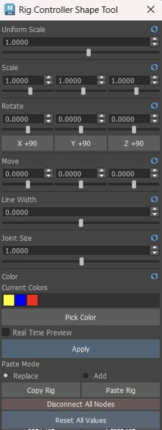
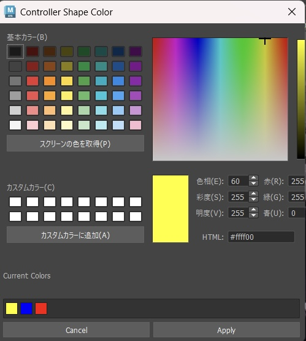

# Rig Controller Shape Tool



Autodesk Maya(2026)上で、リグコントローラーのNURBS Curve Shapeを**安全かつ直感的に調整するためのツール**です。 

Scale / Rotate / Move / Line Width / Color / Shape Copyなど、コントローラー調整で頻繁に行う操作をひとつのUIにまとめています。

本ツールは、**リガーとアニメーターの両方が扱えるController編集ツール**として設計しています。

リガーが効率よくControllerを整えられることはもちろん、アニメーターがリグ内部の構造を意識せずに完成したリグを壊すことなく、自分が操作しやすいShape・大きさ・色へ簡単に調整できることを目指しています。 

特に、

**「調整結果を確認しながら試せること」**
**「既存リグへの影響をできるだけ抑えること」**
**「専門的な操作を意識しなくても簡単に扱えること」**
**「細かな調整を繰り返しても操作が煩雑にならないこと」**

を重視して設計しています。

---

## Features

* **Shape Transform**
  Uniform Scale / XYZ Scale / Rotate / Move / +90° Rotation

* **Real Time Preview**
  調整結果をViewportへリアルタイムに反映し、確認してから確定できます。

* **Fine Adjustment**
  Sliderと数値フィールドを使い分け、粗調整から細かな調整まで行えます。

* **Color Editing**
  Color Picker / HSV / RGB / HTML / Default Colors / Custom Colorsなど、複数の方法から色を調整できます。

* **Copy / Paste Shape**

  既存リグへの影響を考慮しながら、Controller ShapeをReplace / Addできます。

* **Line Width / Joint Size**
  CurveのLine WidthやJoint Sizeも同じUIから調整できます。

* **Apply / Reset / Rollback**
  編集内容を確認しながら試し、必要な変更だけを確定できます。

* **Undo / Redo**
  Maya標準のUndo / Redoに対応しています。

* **Multiple Controller Support**
  複数Controllerをまとめて選択した状態での編集に対応しています。

---

## Overview

リギングでは、Controllerを作成したあとにも、

* キャラクターのシルエットに合わせて大きさを変更する
* 見やすい角度へShapeを回転する
* 左右や部位ごとに色を調整する
* Shapeだけを操作しやすい位置へ移動する
* 既存ControllerのShapeを別の形へ変更する

といった細かな調整が何度も発生します。

また、Controllerはリガーが作成して終わりとは限りません。

実際にアニメーションを付ける中で、

「もう少し大きい方が選択しやすい」
「この角度から見たときにControllerが見えにくい」
「別の色にした方が左右を判別しやすい」

など、**アニメーター側でControllerを調整したい場面**も出てきます。 
 
Maya標準機能だけでもこれらの編集は可能ですが、CV選択、Component Modeへの切り替え、Pivot調整、Shape Nodeの扱いなどを理解したうえで、既存リグを破綻させないよう注意して操作する必要があり、時間と負担がかなり大きくなってしまいます。 
 
そこで本ツールでは、

**「Controllerを選択した状態から、誰でも簡単に、直感的にShapeを調整できること」**

を基本方針としています。 

リガーにとっては、日常的なController調整を効率化するツールとして。
アニメーターにとっては、リグ内部を直接編集せず、自分が扱いやすいControllerへ調整するためのツールとして。

Preview、Rollback、Undo、Selection復元まで含め、**リグ内部の構造を過度に意識しなくても安全に試行錯誤できるワークフロー**を目指しています。

---

# Shape Editing

Controller Shapeの大きさ・向き・位置を、**Controller Transformを変更せずに調整**できます。

Maya標準機能でCurve Shapeを編集する場合は、Component Modeへ切り替えてCVを選択し、編集内容に応じてScale / Rotate / Moveを行う必要があります。

本ツールではControllerを選択したまま、ひとつのUIからShapeを調整できます。

---

## Uniform Scale

Controller Shape全体をXYZ均等に拡大・縮小します。

「もう少し大きくして選択しやすくしたい」
「キャラクターに対して少し小さくしたい」

といった調整を、ひとつの値で行えます。

数値入力だけでなくSliderからも操作できるため、Viewport上のControllerを見ながらｔサイズを調整できます。 


---

## XYZ Scale

X / Y / Zを個別にScaleできます。

Uniform Scaleで全体のサイズを変更するだけでなく、

* 横方向だけ広げる
* 縦方向だけ縮める
* 奥行きだけ調整する

といった、Shapeそのものの細かな調整が可能です。

---

## XYZ Rotate

X / Y / Zを個別に回転できます。

Controller Transformそのものを回転させるのではなく、**Curve Shapeを回転**するため、リグ上のTransformを維持したまま見た目の向きだけを変更できます。

また、Controller Shapeの方向変更で頻繁に使用する、

* X +90°
* Y +90°
* Z +90°

をワンクリックで実行できます。

大きな方向変更は+90°ボタン、細かな角度調整は数値フィールドやSliderという使い分けができます。

---

## XYZ Move

X / Y / Z方向へCurve Shapeを移動できます。

Controller Transform自体を移動するのではなく、**Curve CV側を移動**します。

そのため、

「Controllerの位置は正しいが、Shapeだけ少し外側へ出したい」

といった場合にも、リグ上の基準位置を変更せず、見た目だけを調整できます。

---

## Shape-Centered Transform

Scale / Rotateでは、Controller TransformのPivotではなく、**実際に表示されているCurve Shapeの中心**を編集基準として使用します。

リグでは、Controller Transformの原点とCurve Shapeの中心が一致しているとは限りません。

その状態でTransformのPivotを基準にScale / Rotateすると、Shapeの大きさや向きだけを変更したい場合でも、表示位置までずれてしまうことがあります。

そこで本ツールではControllerごとにCurve Shapeの中心を取得し、

**TransformやPivotを変更せず、見えているShapeをその場で編集**

できるようにしています。

複数Controllerを選択した場合も、選択全体の中心ではなく、それぞれのControllerを独立して処理します。

---

## Fine Adjustment

各Transform項目には、**数値フィールドとSliderの両方**を用意しています。

SliderではViewportを見ながら感覚的に調整し、数値フィールドでは正確な値や細かな差を調整できます。

さらに数値フィールドでは、カーソルが置かれている桁に応じて増減量が変化します。

* 整数部分では大きく調整
* 小数部分では細かく調整

といった操作ができるため、

**Sliderで粗調整 → 数値フィールドで微調整**

という流れを、Step設定を切り替えることなく行えます。

---

## Reset

Uniform Scale / Scale / Rotate / Moveなどの各Sectionには、個別のResetを用意しています。

例えば、

「Scaleは残してRotateだけやり直したい」
「ScaleXは残してScaleYZだけやり直したい」 

という場合でも、他の調整内容を維持したまま対象Sectionだけを戻せます。

さらに、**Reset All Values**からすべての調整値をまとめてResetできます。
個別の際は右クリックからリセットが可能です。


---

## Line Width

Curve ShapeのLine Widthを調整できます。

Controllerの形や色だけではなく、線の太さも同じUIから変更できるため、Viewport上での視認性に合わせて調整できます。

---

## Joint Size

選択Jointの表示サイズを調整できます。

Controller Shapeの編集だけでなく、リグ構築中に頻繁に行うJointの視認性調整も同じUIへまとめています。

---

# Real Time Preview

Real Time Previewを有効にすると、数値やSliderを変更した結果をViewportへリアルタイムに反映します。

通常であれば、

`値を変更 → Apply → 確認 → Undo → 再調整`

となる操作を、

`値を変更 → 確認 → 微調整 → Apply`

という流れで行えます。

Preview中は編集前のShape情報を保持しており、Applyするまでは確定しません。

PreviewをOFFにした場合やWindowを閉じた場合、別の編集へ移った場合には、未確定の変更を元の状態へRollbackします。

そのため、

**気軽に数値を動かして比較し、良い結果だけを確定する**

ことができます。

---

# Color Editing



Controller Colorも、Shape Transformと同じツール内から編集できます。

色変更は単純なColor Pickerだけではなく、**感覚的な色選びから正確な数値指定まで、複数の方法で調整できること**を重視しています。

メインWindowには、現在選択しているControllerの色を**Current Colors**として表示します。

**Pick Color**から専用のColor Dialogを開き、より詳細な調整を行えます。

---

## Multiple Color Inputs

色は用途に合わせて、複数の方法から指定できます。

**Color Picker**
色相・彩度・明度を視覚的に確認しながら選択できます。

**Hue / Saturation / Value**
HSV値を使用して色を調整できます。

**RGB**
Red / Green / Blueを数値で直接指定できます。

**HTML / HEX**
HEX形式で正確な色を入力できます。

**Screen Color Pick**
画面上に表示されている色を直接取得できます。

感覚的に色を探したい場合と、決まった値を正確に使用したい場合の両方に対応しています。

---

## Default Colors

あらかじめ複数の基本色を用意しています。

Controller Colorとして使用したい色へ素早くアクセスできるため、毎回Color Pickerから色を作る必要がありません。

同じ色を繰り返し使用したい場合にも、ワンクリックで選択できます。

---

## Custom Colors

頻繁に使用する色は、**Custom Colorsとして登録**できます。

例えば、

* Left / Right用の色
* Center Controller用の色
* IK / FK用の色
* キャラクター固有のController Color

などを登録しておけば、毎回数値を入力し直す必要がありません。

既定色だけではなく、**自分やプロジェクトに合わせたColor Paletteを作れること**を意識しています。

---

## Current Colors

現在選択しているControllerが使用している色を一覧表示します。

複数Controllerを選択した場合も、それぞれの現在色を確認できます。

表示されている色をそのまま利用できるため、

**既存Controllerと同じ色へ素早く合わせる**

ことができます。

RGB値を確認して入力し直す必要はありません。

---

## Color Preview

Color Dialogで色を変更すると、選択中ControllerへリアルタイムにPreviewします。

そのため、

`色を設定 → Dialogを閉じる → Viewportで確認 → Dialogを開き直す`

という往復を行う必要がありません。

キャラクター全体や他のControllerとの関係を見ながら、その場で色を比較できます。

Applyするまでは編集前のOverride状態を保持しているため、試した色が合わなければCancelで元の状態へ戻せます。

---

## Maya Interaction During Color Editing

Color Dialogは**非Modal**で設計しています。

Dialogを開いている間も、

* Viewportを回転する
* Controllerを別角度から確認する
* Outlinerを操作する
* Scene全体との色のバランスを見る

といったMaya側の操作を続けられます。

Controller ColorはColor Picker単体を見て決めるのではなく、**実際のMaya Viewport上でどう見えるか**が重要です。

そのため、

**色を選ぶ → Maya上で確認する → Viewportを動かす → 色を微調整する**

という一連の操作を、Color Dialogを閉じずに行えるようにしています。

---

## Maya Viewportとの色味

Color Dialog内の見え方だけではなく、**実際にMaya上へ表示されたControllerの色を確認しながら調整できること**を重視しています。

Color Picker、HSV、RGB、HEX、Previewなど複数の入力方法を組み合わせることで、

**「数値として正しい色」ではなく「Viewport上で意図した見え方になる色」**

を探しやすい設計にしています。

---

# Copy / Paste Shape

**Copy Rig / Paste Rigは、本ツールで特に重視している機能のひとつです。**

完成済みリグのControllerについて、**既存リグへの影響を考慮しながら、見た目のCurve Shapeを別のControllerのShapeへ変更**できます。

この機能では、一般的な「コピー元 → コピー先」というCopy / Pasteとは少し異なり、最初に**基準とする既存リグController**を`Copy Rig`で記録します。

その後、新しい見た目として使用したいControllerを選択して`Paste Rig`を実行すると、選択したModeに応じてController Shapeが再構築されます。

```text
Existing Rig Controller
        │
        │ Copy Rig
        ▼
   Record Target
        │
        │
New Shape Controller
        │
        │ Paste Rig
        ▼
Rebuild According to Mode
```

Replaceでは記録した既存ControllerのShapeを置き換え、Addでは新しいControllerを構築して対応可能なTransform接続を移行します。

---

## Replace

`Paste Mode: Replace`では、`Copy Rig`で記録した既存リグControllerのShapeを、`Paste Rig`実行時に選択しているControllerのShapeへ置き換えます。

```text
Existing Rig Controller
Transform / Rig Role / Transform Connections
              +
              │
              │ Shape Replace
              ▼
Shape from Selected Controller
```

置き換える中心はCurve Shapeであり、記録したControllerのリグ上の役割を維持したまま見た目を変更することを目的としています。

そのため、

* Translate
* Rotate
* Scale
* Pivot

など、既存Controllerが持つTransformを不用意に変更せずにShapeを変更できます。

「このControllerの動作や配置はそのまま維持して、操作しやすい別のShapeへ変更したい」

といった場合に使用できます。

Shape提供側として選択したControllerは、移植処理後、安全に削除可能な場合は整理されます。

---

## Add

`Paste Mode: Add`では、`Copy Rig`で記録した既存リグControllerをもとに新しいControllerを構築し、`Paste Rig`実行時に選択しているControllerのShapeを使用して再構成します。

この処理では、複製時に生成された既存Shapeをそのまま残すのではなく、新しい見た目として使用するShapeへ置き換えたうえで、元のControllerから対応可能なTransform接続を新しいControllerへ移行します。

Replaceが**記録した既存Controllerを維持したままShapeを置き換える処理**なのに対して、Addは**新しいControllerを構築し、対応可能なTransform接続を移行する処理**です。

同じShape変更でも内部の処理方法が異なるため、用途に応じてReplace / Addを選択できます。

---

## Preserve Curve Definition

Copy / Pasteでは、CV位置だけではなく、Curve Shapeを再構築するために必要な情報を取得します。

主に、

* CV
* Degree
* Knot
* Form
* Rational

などのCurve定義を使用してShapeを再構築します。

これにより、単純なCurveだけでなく、Periodic CurveやRational Curveも考慮したShape移植を行います。

Display SettingsはCurve定義とは別に扱います。

記録した既存ControllerのShapeから必要なDisplay設定を取得し、生成するShapeへ適用することで、Controllerとしての表示状態を可能な範囲で引き継ぎます。

---

## Preserve Rig Information

完成済みControllerでは、Shapeだけでなく、TransformやConnectionなど、リグ上の役割に関わる情報を持っている場合があります。

Copy / Pasteでは、単にCurve Shapeを複製するだけではなく、**記録したControllerがリグの中で担っている役割を考慮しながら、見た目を変更すること**を重視しています。

Replaceでは、記録した既存Controllerを維持したままShapeを置き換えます。

Addでは、新しいControllerを構築してShapeを再作成し、元のControllerから対応可能なTransform接続を移行します。

処理方法は異なりますが、どちらもControllerの見た目を変更する際に、既存リグへの影響を抑えることを目的としています。

リガーがController Shapeを整理・変更する用途だけでなく、アニメーターが既存リグを自分にとって扱いやすいShapeへ変更する用途も想定しています。

---

## Why Shape Copy / Paste?

Shape Copy / Pasteは、このツール全体の設計方針を特に強く反映した機能です。

リガーがController Shapeを統一したい場合だけでなく、アニメーターが、

「このControllerはもう少し選択しやすい形にしたい」

「同じ役割のControllerとShapeを揃えたい」

「操作しづらいので、別のShapeへ変更したい」

と感じる場面でも使用できます。

通常であればShape Node、Transform、Pivot、Connectionなどを確認しながら行う必要がある操作を、

**基準とするRigを記録 → 新しいShapeを選択 → Modeに応じて再構築**

という分かりやすい操作へまとめています。

Shapeそのものをコピーする操作ではなく、**既存リグへの影響を考慮しながらControllerの見た目を変更するためのワークフロー**として設計しています。

---

# Disconnect

**Disconnect All Nodes**では、選択Controllerに対する接続解除をまとめて実行します。

ControllerおよびCurve Shapeの接続を整理し、必要なAttribute状態やParent状態も処理します。

処理全体はひとつのUndo Chunkとして実行されるため、Maya Undoで操作前の状態へ戻すことができます。

---

# Workflow

基本的なShape調整は、Controllerを選択した状態から行えます。

1. 調整したいControllerを選択
2. Scale / Rotate / Moveなどを調整
3. Real Time Previewで結果を確認
4. 必要に応じてColor / Line Widthなどを調整
5. Applyして確定

結果が合わなければ、ResetやRollbackによって編集前の状態へ戻せます。

基本となるのは、

**選択 → 調整 → 確認 → 確定**

というシンプルな流れです。

Shapeを別のControllerから移植する場合は、

1. **基準とする既存リグController**を選択
2. `Copy Rig`で記録
3. `Replace / Add`を選択
4. **新しい見た目として使用したいController**を選択
5. `Paste Rig`を実行
6. 選択したModeに応じてController Shapeを再構築

という流れで操作します。

```text
Select Existing Rig
        ↓
     Copy Rig
        ↓
Choose Replace / Add
        ↓
 Select New Shape
        ↓
     Paste Rig
        ↓
Rebuild Controller Shape
```

`Replace`では記録した既存ControllerのShapeを置き換え、`Add`では新しいControllerを構築して対応可能なTransform接続を移行します。

一般的なCopy / PasteとはShapeの移動方向が異なるため、**`Copy Rig`では新しいShapeではなく、基準とする既存リグControllerを先に記録すること**が操作上のポイントです。

---

# Design

## Rigger & Animator Friendly

本ツールは、**リガーとアニメーターの両方が扱えること**を前提に設計しています。

リガーには、Controller制作・調整を効率化するための細かな編集機能を。

アニメーターには、Component ModeやShape Nodeなどのリグ内部を直接操作せず、Controllerを自分が扱いやすい状態へ調整できる環境を。

専門的な処理はツール側で行い、ユーザー側の操作はできるだけ、

**選択して、見ながら調整する**

という形にまとめています。

---

## Non-Destructive Editing

Transform値やPivot、既存のリグ構造を不用意に変更せず、可能な限りCurve Shape側を操作します。

PreviewやColor EditについてもApply前の状態を保持し、CancelやWindow Close時には元の状態へ戻せるようにしています。

---

## Predictable Behavior

操作結果をユーザーが予測しやすいことも重視しています。

* Applyした変更は確定する
* ApplyしていないPreviewは戻せる
* Resetした項目だけを戻せる
* 複数選択でも各Controllerを独立して処理する
* CancelしたColor変更は元へ戻る
* Tool内部で変更したSelectionは可能な限り復元する

細かな操作でも、意図しないScene変更が起きにくい挙動を目指しています。

---

## Interaction Design

本ツールでは、機能数そのものよりも、**何度も繰り返し使ったときの操作感**を重視しています。

例えば、

* Controllerを選択した状態からそのまま編集できる
* Sliderで大きく調整できる
* 数値フィールドで細かく詰められる
* カーソル位置の桁によって増減量を変えられる
* 90°回転をワンクリックで実行できる
* SectionごとにResetできる
* Previewで結果を確認してから確定できる
* Color Dialogを開いたままMayaを操作できる
* Current Colorsから既存色を再利用できる
* Copy / Pasteで既存リグの役割を考慮しながらShapeを変更できる
* 複数Controllerをまとめて調整できる

といった、小さな挙動を積み重ねています。

---

# Validation / Safety

Shape編集ツールでは、操作の速さと同じくらい、**「失敗したときに安全に戻れること」**を重視しています。

## Undo / Redo

通常の編集操作はMayaのUndo Chunk単位でまとめています。

ひとつのツール操作によってUndo履歴が細かく分割されないようにしています。

---

## Rollback

Real Time PreviewやColor Previewのように複数のユーザー操作にまたがる処理では、編集開始時の状態をCaptureします。

以下の状態に応じてCommitまたはRollbackします。

* Apply
* Cancel
* Preview OFF
* Window Close
* 別編集の開始
* 処理中の例外

途中で例外が発生した場合も、Undo Chunkを閉じ忘れないよう管理しています。

---

## Selection Preservation

Copy / Pasteなど内部でSelectionを変更する可能性がある処理では、操作前のSelectionを保存し、処理終了後に可能な限り復元します。

ツールを使用したことで、

「今どのControllerを触っていたのか分からなくなる」

状態を避け、連続した作業を妨げないようにしています。

---

## Multiple Controller Support

複数Controllerを選択した状態での編集に対応しています。

Scale / Rotateでは、選択全体をひとつのShapeとして処理するのではなく、**Controllerごとに独立したShape中心を使用**します。

これにより、左右のControllerなどをまとめて選択しても、それぞれがその場で拡縮・回転します。

---

## Safeguards

実制作リグへの使用を想定し、破壊的な操作には複数の保護を設けています。

* Copy / PasteおよびDisconnectでReferenced Controllerへの対象操作を拒否
* 不正なSelectionを操作前に検出
* Copy Buffer消失を検出
* Preview / Color Sessionの二重開始を防止
* Copy / Paste失敗時のRollback
* Undo Chunkの確実な終了
* Window Close時の未確定編集Rollback
* Selection復元

エラーを単純に握り潰すのではなく、ユーザーが修正可能な問題はWarningとして通知し、予期しない問題と分離しています。

---

# Architecture

ツール内部は、UIとMaya操作を直接結びつけず、責務ごとに分離しています。

```text
UI
 ↓
Feature / Use Case
 ↓
Service
 ↓
Maya API
```

### UI

Widget、Layout、Signalなど画面表示を担当します。

Maya Sceneの具体的な編集処理は行いません。

### Feature

Transform、Preview、Color、Copy / Paste、Disconnectなど、ユーザー操作単位の処理を担当します。

選択条件、処理順序、Undo、Sessionなどを管理します。

### Service

Featureが必要とする操作をMaya APIへ橋渡しします。

DAG Path、Curve Shape Query、Selection、Undoなど、Maya固有の処理をこの層へ集約しています。

### Core

Maya / Qtに依存しないDomain Model、State、Transform計算、Session Lifecycleを管理します。

これにより、ツールの中心となるロジックをDCC環境から分離しています。

---

## Why This Architecture?

個人制作のMaya Toolでは、すべての処理をひとつのPythonファイルへまとめることもできます。

本ツールでは、機能追加を続けた場合でも既存機能を壊しにくくするため、責務を分離しています。

一方で、抽象化そのものを目的にはしていません。

DI Framework、Repository階層、Event Busなどは導入せず、必要なServiceをComposition Rootで明示的に組み立てています。

**小規模ツールとして追いやすい構造を保ちながら、変更に耐えられる設計にすること**

を方針としています。

---

# Testing

Pure Python Test、Maya Integration Test、UI Regression Testを用意しています。

主に以下を検証しています。

* Transform計算
* Preview Commit / Rollback
* Color Commit / Rollback
* Undo / Redo
* 複数Controller
* Periodic / Rational Curve
* Copy / Replace / Add
* Connection移行
* Disconnect
* Namespace
* Referenced Node
* Locked Nodeでの失敗時Rollback
* Selection復元
* Window Lifecycle
* UI Context Menu

Maya GUI固有のViewport操作やDialogの実操作については、自動テストと区別し、Maya 2026 GUI上で手動確認する方針としています。

---

# Technical Details

* Autodesk Maya 2026
* Python 3
* PySide6
* Maya Python API
* Maya Undo Chunk
* Qt Signal / Widget

## Technical Focus

* Curve Shape中心を利用したTransform処理
* Preview Sessionの状態管理
* Color Override状態のCapture / Restore
* Curve Shape定義のCapture / Reconstruction
* Undo / Rollback管理
* Selection Preservation
* Periodic / Rational Curve対応
* UIとMaya Scene処理の責務分離

---

# Requirements

* Autodesk Maya 2026
* Python 3
* PySide6

Maya 2026に同梱されているPython環境での使用を想定しています。

---

# Installation

RepositoryをMayaのscriptsディレクトリへ配置します。

```text
<Maya userAppDir>/scripts/Rig-Ctrl-Shape-Tool/
```

## Launch

通常起動には、Repository直下の`launch.py`を使用します。

Maya Script EditorのPythonタブから起動する場合：

```python
import os
import runpy
import maya.cmds as cmds

maya_dir = os.path.normpath(cmds.internalVar(userAppDir=True))

launch_file = os.path.join(
    maya_dir,
    "scripts",
    "Rig-Ctrl-Shape-Tool",
    "launch.py",
)
runpy.run_path(launch_file, run_name="__main__")
```

`launch.py`がTool Packageの読み込みと起動を行います。

`launch.py`は通常起動用のEntry Pointです。

## Shelf

上記のScript Editor用コードをPython Shelf Buttonへ登録することで、通常使用時はShelfから`launch.py`を実行できます。

`dev_launch.py`は開発用のImport Entryとして配置しています。

---

# Project Structure

```text
Rig-Ctrl-Shape-Tool/
├─ launch.py
├─ dev_launch.py
├─ app.py
│
├─ core/
│  ├─ domain.py
│  ├─ state.py
│  ├─ sessions.py
│  ├─ transform_math.py
│  ├─ errors.py
│  └─ constants.py
│
├─ features/
│  ├─ transform.py
│  ├─ preview.py
│  ├─ color.py
│  ├─ copy_paste.py
│  ├─ disconnect.py
│  └─ controls.py
│
├─ services/
│
├─ maya/
│  ├─ utils.py
│  ├─ curve_io.py
│  └─ connections.py
│
├─ ui/
│
└─ tests/
```

---

# Development Focus

このツールでは、機能数を増やすことよりも、**リガーとアニメーターが制作中に何度も使いたくなる操作感**を重視しました。

リガーにしか使えない専門ツールにするのではなく、リグ内部の構造に詳しくないユーザーでも、

**選ぶ → 試す → 見る → 決める**

という分かりやすい流れでControllerを編集できることを目指しています。

そのために、

* Controllerを選んですぐ編集できる
* Sliderで大きく、数値で細かく調整できる
* 編集結果をリアルタイムに確認できる
* 90°回転をワンクリックで行える
* SectionごとにResetできる
* Colorを複数の方法から指定できる
* よく使う色を登録して再利用できる
* Current Colorsから既存Controllerと色を合わせられる
* Color Dialogを開いたままMayaを操作できる
* Copy / Pasteで既存リグの情報を考慮しながらControllerの見た目を変更できる
* 複雑なCurve Shapeも可能な限り維持して移植できる
* 複数Controllerでも自然に動作する
* 操作をやめれば未確定の変更は元へ戻る
* 失敗してもUndoできる
* Tool操作後もSelectionをできるだけ維持する

といった、ひとつひとつは小さな挙動を積み重ねています。

**「できるかどうか」だけではなく、「誰が、制作中に、どう使うのか」まで含めて設計すること**

を、このツールの中心テーマとしています。

---

# License

MIT License

Copyright (c) 2026 Yuzuki Midoshima
